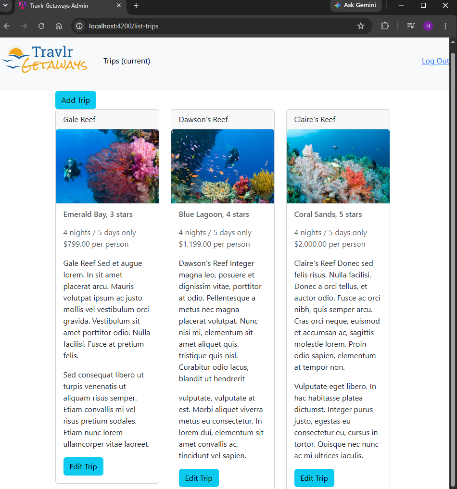
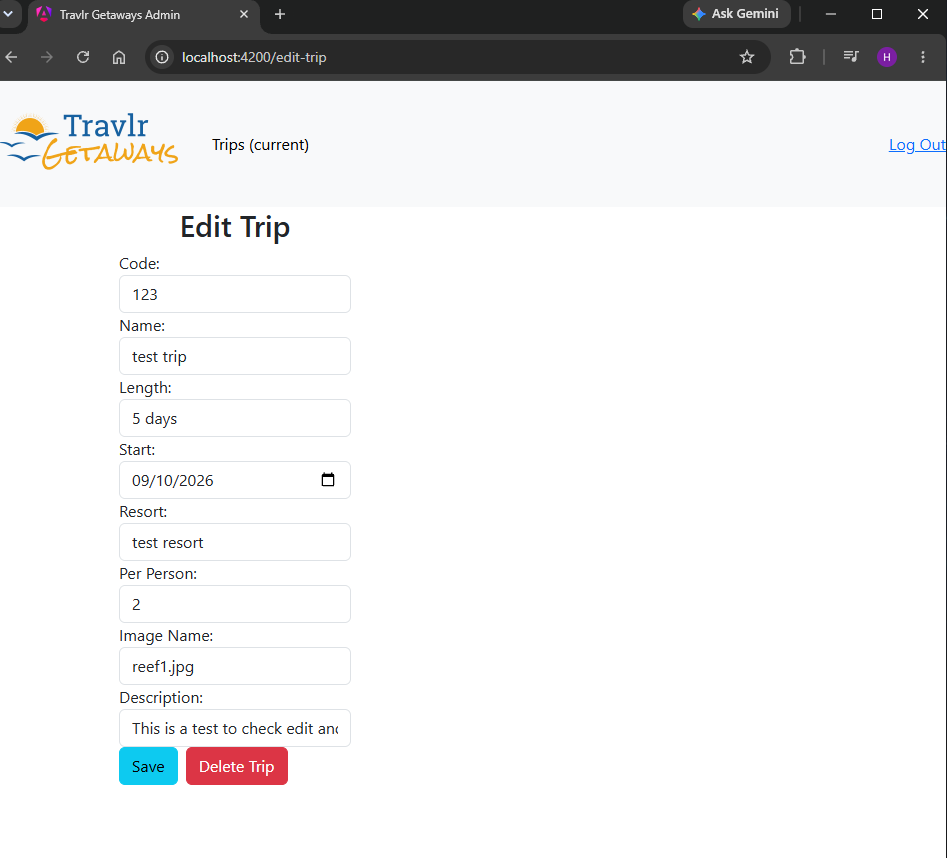

# Travlr Getaways

Travlr Getaways is a full-stack travel application with a customer website and an Angular administration page. Express provides the API, and MongoDB stores the trip and account information. Authenticated users can add, edit, and delete trips.

This project was developed for SNHU’s CS 465 Full Stack Development course using the supplied Travlr website and course guide. The original submission is preserved on the final-coursework branch. The project-improvements branch includes additional functionality, security improvements, testing, and setup instructions.

## Technologies

| Area | Tools |
|---|---|
| Customer website | Express, Handlebars, HTML, CSS, JavaScript |
| Administration page | Angular, TypeScript, Bootstrap |
| Backend | Node.js, Express |
| Database | MongoDB, Mongoose |
| Authentication | Passport, password hashing, JWT |
| Testing | Postman, Node.js test runner, GitHub Actions |

## Original Development

The customer website uses Express and Handlebars to render pages with trip information. The Angular administration page uses a component-based structure, with reusable trip cards and forms for adding and editing trips. Both parts of the application retrieve trip information through the Express API.

During development, I used Postman to test POST and PUT requests. I checked MongoDB to ensure that the information was added and updated in the database. Some issues occurred with CORS configuration and images not loading. These were resolved by adjusting the middleware placement and updating the asset configuration in angular.json.

The original course screenshots show the development of the trip listing, Add Trip form, and Edit Trip form.

## Project Improvements

The updates on the project-improvements branch include:

- Added a Delete Trip button, confirmation message, and API endpoint.
- Fixed the Trips navigation link.
- Replaced public registration with a local admin account creation command.
- Strengthened password hashing while keeping existing accounts compatible.
- Added a minimum length requirement for the JWT secret.
- Added support for MongoDB Atlas through MONGODB_URI.
- Changed database seeding to preserve existing trips.
- Updated debug logs for security.
- Added automated API tests and a GitHub Actions workflow as practice with testing and continuous integration.

## Application Screenshots

**Trip listing:** Admin page showing sample trips and the Add Trip and Edit Trip controls.

**Edit trip:** Form for updating trip details, with Save and Delete Trip controls.

## Running the Application

The application requires Node.js, npm, and MongoDB. MongoDB can run locally or through Atlas. Two terminals are needed because Express and Angular run separately.

1. Download or clone the project-improvements branch. Open the main project folder in a terminal and type npm ci to install its packages.
2. Copy .env.example and name the copy .env. Keep it in the main project folder beside package.json.
3. Set MONGODB_URI to your database connection string. For local MongoDB, use `mongodb://127.0.0.1:27017/travlr` and ensure the database server is running. For Atlas, follow the connection steps below.
4. Set JWT_SECRET to a randomly generated value of at least 32 characters. Keep this value private.
5. Type npm run seed to add the three sample trips to an empty database. The command will stop if trips already exist.
6. Fill in ADMIN_NAME, ADMIN_EMAIL, and ADMIN_PASSWORD in .env. The password must be at least 12 characters. Type npm run create-admin to create the account.
7. Type npm start to start Express. Leave this terminal open.
8. Open a second terminal in the main project folder. Type cd app_admin to enter the Angular folder, then npm ci to install its packages. After installation finishes, type npm start.
9. Open `http://localhost:4200/login` and sign in with the admin account. Select Trips to view and manage the trip information. The customer travel page is at `http://localhost:3000/travel`.

## Connecting with MongoDB Atlas

Atlas allows the application to use MongoDB without installing a database server locally.

1. Create or select a cluster in Atlas.
2. Create a database user with read and write access to the travlr database. Add your current IP address to the IP access list.
3. Select Connect for the cluster and choose Drivers, then Node.js. Copy the connection string into MONGODB_URI in .env.
4. Replace the username and password placeholders with the database user’s information. Set the database name to travlr before the question mark in the connection string. Passwords containing reserved characters must be URL-encoded.

The Atlas database user connects the application to MongoDB. The admin account created during setup is used to log into the travel application. Keep .env out of GitHub because it contains your connection information and secret.

## API Endpoints

| Method | Endpoint | Purpose | Access |
|---|---|---|---|
| GET | /api/trips | Retrieve all trips | Public |
| GET | /api/trips/:tripCode | Retrieve one trip | Public |
| POST | /api/login | Sign in and receive a JWT | Public |
| POST | /api/trips | Add a trip | Authenticated |
| PUT | /api/trips/:tripCode | Update a trip | Authenticated |
| DELETE | /api/trips/:tripCode | Delete a trip | Authenticated |

Public registration is disabled because all accounts currently have access to modify trips. Accounts are created using npm run create-admin.

## Testing

From the main project folder, type npm test.

The automated tests check that unauthenticated trip changes are rejected, public registration is unavailable, deletion handles existing and missing trips, and both original and updated password hashes can be verified.

To check that the Angular application builds, open a terminal in the app_admin folder and type npm run build.

GitHub Actions runs the tests and Angular build for pull requests and pushes to the project-improvements branch.

The deletion tests use mocked database operations. To check the full application, run it with MongoDB and use a temporary trip to test adding, editing, and deleting. Refresh the listing after each change to confirm that it was saved.

## Current Limitations

- All authenticated accounts have the same editing access. Separate permission roles are not implemented.
- The Angular application connects to the API at `http://localhost:3000`.
- Sample trip data contains placeholder descriptions. Editing a trip updates MongoDB, but does not change data/trips.json.
- The application runs locally with either local MongoDB or Atlas. A publicly hosted demo is not included.
- Automated database integration tests are a possible future improvement.
